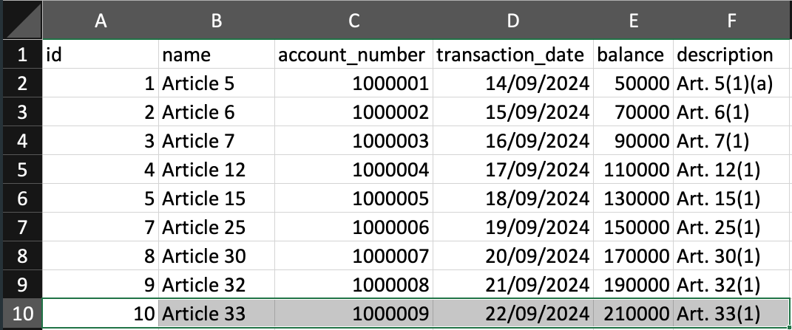

## Reconciliation app
To get started, run the following code:

```bash
npm npm install

npm run dev
# or
yarn dev
# or
pnpm dev
# or
bun dev
```

Open [http://localhost:3000](http://localhost:3000) with your browser to see the result.

## Allowed CSV sample file

